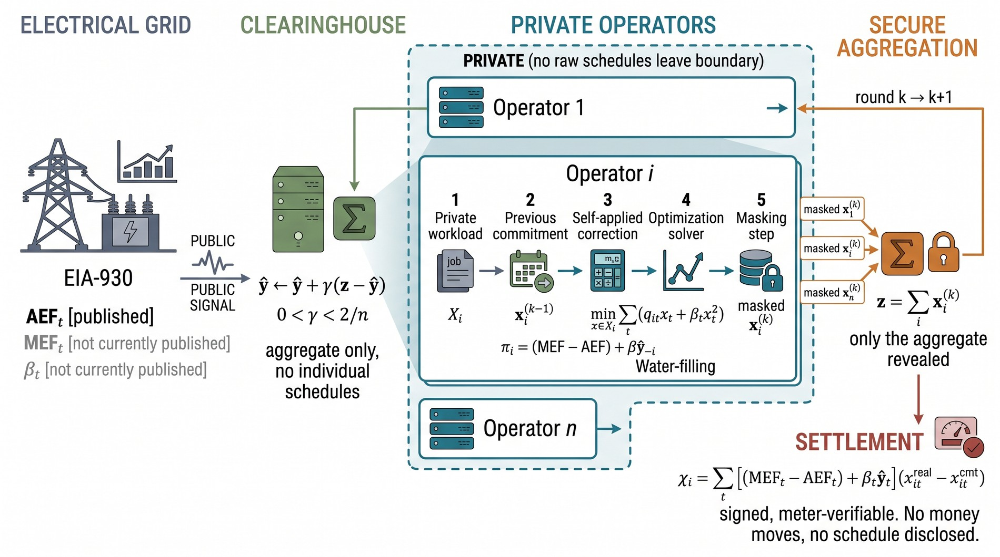
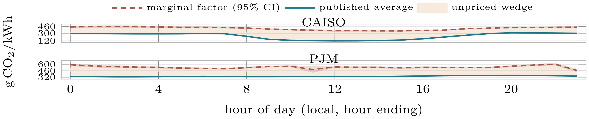
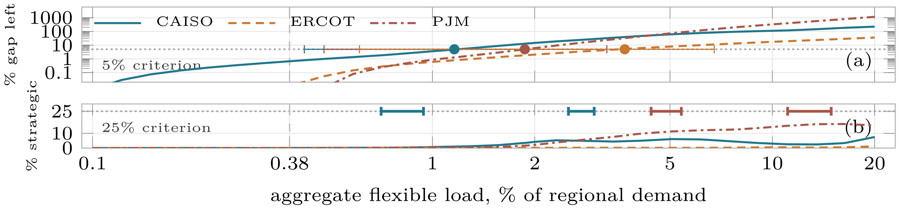
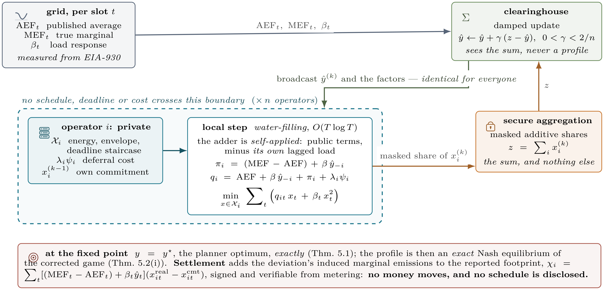

<h1 align="center">green-hour</h1>

<p align="center">
  <em>When Every Agent Chases the Same Green Hour:<br>
  Equilibrium Inefficiency and Mechanism Design for Competing Carbon-Aware Datacenter Schedulers</em>
</p>

<p align="center">
  
  
  
  
</p>

<p align="center">
  
</p>

Simulator, solver, analytic oracles, and reproducible experiments for the paper
above. Everything needed to regenerate every number it reports is in this
repository.

Cloud operators increasingly delegate workload placement to agents that shift
flexible computation toward hours of low grid carbon intensity. Each agent
optimises its own operator's *reported* emissions correctly, but they all read
the same public signal, so their schedules correlate. This repository models
that as an atomic splittable congestion game over time slots, calibrates it on
public grid data, and measures what the correlation costs.

---

## Contents

- [At a glance](#at-a-glance)
- [What this artifact claims](#what-this-artifact-claims)
- [Key results](#key-results)
  - [1. The measurement: the marginal factor is flat](#1-the-measurement-the-marginal-factor-is-flat)
  - [2. The deployment threshold](#2-the-deployment-threshold)
  - [3. The estimator is weakly identified](#3-the-estimator-is-weakly-identified)
  - [4. The workload model can flip the sign](#4-the-workload-model-can-flip-the-sign)
- [The SHADE protocol](#the-shade-protocol)
- [Installation](#installation)
- [Quick start](#quick-start)
- [Data](#data)
- [Reproducing the paper](#reproducing-the-paper)
- [Testing](#testing)
- [Repository structure](#repository-structure)
- [Figures](#figures)
- [Correctness evidence](#correctness-evidence)
- [Implementation notes](#implementation-notes)
- [Troubleshooting](#troubleshooting)
- [Citation](#citation)
- [License](#license)

---

## At a glance

| | Value | Source |
|---|---|---|
| Measured congestion strength | **κ = 0.007–0.052** | `results/E3.json` |
| Gap closed by publishing a level-correct marginal factor | **99.9%** | `results/E3.json` |
| Gap closed by SHADE | **100.0%** (Theorem 3, exact) | `results/E3.json` |
| Flexible-load share where a static signal stops closing 95% of the gap | **1.15% CAISO**, 1.65% PJM, 3.64% ERCOT, against **0.38% today** | `results/E9.json` |
| Ratio the theory uses, across 20 specifications | **η = 0.630–0.719** | `results/E8.json` |
| Hardware | One CPU core. No GPU anywhere. | — |

The short version: **the accounting error dominates the strategic one at today's
scale.** Fixing the published signal is worth far more than any mechanism, and
the mechanism becomes necessary only three to ten times above current flexible
demand.

---

## What this artifact claims

| Component | Status |
|---|---|
| **Grid side** | **Measured.** EIA-930, July–December 2024, public, no API key. Per-hour-of-day average and marginal emission factors and response curvature for CAISO, ERCOT and PJM. See [`data/README.md`](data/README.md) for the exact file, its SHA-256, and the identifying assumptions. |
| **Workload side** | **Two models, and the difference between them is a finding.** The *generated* one (sizes, staircases, envelopes) is the reference. The *trace-derived* one takes operator sizes, market share, arrival shape and power envelopes from the Azure 2019 VM trace, which is CC BY 4.0 and therefore redistributable. Deadlines are in **no** public trace and stay swept; so does the diurnal phase, since the trace carries no timezone. Borg and Alibaba remain non-redistributable and are not used. |
| **Everything in `results/`** | Regenerated by the scripts in `experiments/`, never hand-edited. Each file carries a `provenance` field. |
| **What is not here** | The cooperative-MARL baseline (needs GPU training; reported absent, not estimated). Great Britain and Germany (the available feed gives no absolute demand, so no marginal regression is possible). |

---

## Key results

### 1. The measurement: the marginal factor is flat

The marginal emission factor is close to flat across the day; the *average*
factor is what moves. In CAISO the published average falls by **2.6×** while
the factor an increment of load actually pays varies by **1.29×**. The shaded
band is the wedge no operator currently prices.

<p align="center">
  
</p>

<sub>Paper Figure 1, regenerated from <code>results/E1.json</code>.</sub>

### 2. The deployment threshold

A static marginal signal stops closing 95% of the gap once flexible load
reaches **1.15% of regional demand in CAISO** (10th–90th percentile
0.42–1.35), **1.65% in PJM** and **3.64% in ERCOT**, against **0.38% today**.
That is three to ten times current flexible demand.

The threshold barely moves with the number of operators (0.88–1.22% over
n ∈ [4, 64]) and moves a great deal with the grid's curvature and the fleet's
power envelope, so it is a property of physics and flexibility rather than of
market structure. The **strategic** threshold — where congestion reaches a
quarter of the gap — is never reached below a 20% flexible share in CAISO under
the primary specification.

<p align="center">
  
</p>

<sub>Paper Figure 2, regenerated from <code>results/E9.json</code> and verified
coordinate by coordinate by <code>scripts/make_threshold_figure.py --check</code>.</sub>

### 3. The estimator is weakly identified

Across four accounting boundaries, five regressors, five estimators and nine
windows, the *level* spans a 43% range in CAISO while η, the ratio the theory
uses, moves only **0.630–0.719**. Two placebos collapse as they should
(permuted regressor 3–5% of the estimate, one-day lead 2–19%). The net-load
identifying restriction is rejected at 5% in 17 of 24 CAISO bins, though the
unrestricted estimate gives η = 0.663 against 0.671.

> [!IMPORTANT]
> **No estimate in this repository is causal**, and none is presented as such.
> `experiments/V22_iv_identification.py` documents an instrumental-variables
> attempt at the simultaneity problem and reports what it finds.

### 4. The workload model can flip the sign

On the generated workload the carbon-aware equilibrium (1.0419) does not beat
carbon-agnostic scheduling (1.0401). On the trace-derived workload this
reverses: carbon-aware wins in CAISO at all 24 diurnal alignments and loses in
ERCOT and PJM.

The supportable statement is therefore the weaker one. The benefit of
carbon-aware deferral on true marginal emissions is small, and its sign depends
on how concentrated the counterfactual is. `results/V15.json` reports the paired
tests behind it.

---

## The SHADE protocol

Operators solve locally and emit only masked per-slot intentions. The
clearinghouse receives the **securely aggregated** sum, damps it, and broadcasts
the aggregate `ŷ` together with the published factors. **Each operator then
forms its own adder** by subtracting its own contribution locally, so the adders
are *not* identical across operators — that is what makes the correction
load-responsive without anyone holding a schedule.

<p align="center">
  
</p>

<sub>Paper Figure S4, exported from the manuscript's own <code>.tex</code> by
<code>scripts/export_figures.py</code>.</sub>

Algorithm 1 in the paper's supplement gives the pseudocode; `src/gh/mech.py` is
the implementation.

> [!WARNING]
> **This is schedule confidentiality via secure aggregation, not differential
> privacy.** The DP variant is implemented (`mech.noise_scale`) and measured, and
> it does not work at this scale: every configuration lands at 1.11–1.14 of the
> planner against a 1.046 equilibrium, because the unit of privacy is a whole
> daily profile whose sensitivity is the order of the entire per-slot aggregate.
> It is reported as a costed negative result, not as a feature.

---

## Installation

### Requirements

| | |
|---|---|
| Python | 3.9+ (developed and measured on 3.11.9) |
| Runtime dependencies | `numpy`, `scipy` — nothing else |
| Test runner | `pytest` (not a runtime dependency) |
| Figure rebuilds only | `pdflatex` and `pdftocairo` on `PATH`; `Pillow` for `--web-only` |

The package is used **in-tree**. There is no `setup.py` or `pyproject.toml`, and
nothing needs installing — the test and experiment scripts add `src/` to
`sys.path` themselves.

### Linux / macOS

```bash
git clone https://github.com/adeliusa486/Green-Hours.git
cd Green-Hours
python -m venv .venv && source .venv/bin/activate
pip install -r requirements.txt
pip install pytest
```

### Windows (PowerShell)

```powershell
git clone https://github.com/adeliusa486/Green-Hours.git
cd Green-Hours
python -m venv .venv; .\.venv\Scripts\Activate.ps1
pip install -r requirements.txt
pip install pytest
```

`requirements.txt` floats (`numpy>=1.24`, `scipy>=1.10`). The numbers in the
paper were produced with **numpy 1.26.4 and scipy 1.17.1**; pin those to
reproduce the published digits exactly.

---

## Quick start

Verify the artifact against its own committed results. No data download, no
solver time, about one second:

```bash
cd tests
python test_claims.py
```

This checks every headline number in the paper against the JSON file that
produced it. It should report **`57 agree, 0 disagree, 0 skipped`**. If it does,
the repository you have is internally consistent and you can trust the tables in
`results/` before spending any compute.

---

## Data

Neither source dataset is committed. Both are public.
[`data/README.md`](data/README.md) carries the URLs, retrieval dates, SHA-256
sums and identifying assumptions.

```bash
# EIA-930, 48 MB. Needed by E1, E3, E8, E9. Run from the repository root.
curl -o data/EIA930_BALANCE_2024_Jul_Dec.csv \
  https://www.eia.gov/electricity/gridmonitor/sixMonthFiles/EIA930_BALANCE_2024_Jul_Dec.csv

# Azure 2019 VM trace, CC BY 4.0, 437 MB. Needed by E11 only.
bash scripts/fetch_azure.sh
```

On Windows, run `fetch_azure.sh` from Git Bash or WSL. Everything except E11
runs without it.

---

## Reproducing the paper

Run each stage from the directory shown. Every script writes
`results/<ID>.json` with a provenance header.

### Stage 1 — Correctness, before believing any experiment

```bash
cd tests
python test_solver.py             # QP primitive vs SLSQP and trust-constr
python test_game.py               # 9 analytic oracles for the game layer
python test_planner_reduction.py  # the planner denominator, vs SLSQP
python test_theorems.py           # every theorem, re-derived and attacked
python test_cliff_solver.py       # KKT certificate for the piecewise solver
python test_planner_uniqueness.py # y* unique, the profile is not
python test_claims.py             # every headline number vs results/*.json
```

### Stage 2 — Calibration, identification audit, main table

```bash
cd experiments
python E1_calibrate.py            # AEF/MEF/beta/eta/kappa + 4 sensitivities
python E8_mef_identification.py   # 20 specifications, placebos, bootstrap
python E3_main.py                 # Table 1, 20 seeds x 3 regions
python E4_E7_ablation.py          # operational metrics and the ablation
```

### Stage 3 — Threshold, mechanism region, trace workload

```bash
cd experiments
python E9_threshold.py               # dense share sweep + sensitivity + E8 specs
python E5_when_mechanism_matters.py  # the coarse version E9 supersedes
python E10_convergence.py            # the convergence region, adversarially
python derive_azure_workload.py      # reduce the 437 MB trace to 168 kB
python E11_trace_workload.py         # Table 1 on a trace-derived workload
```

### Stage 4 — The falsification suite

```bash
cd experiments
python V1_model_cap.py            # the emissions model's ceiling on eta
python V2_precision.py            # when a noisier signal helps, and when not
python V3_two_slot.py             # the exact two-slot proposition
python V4_shade_fixpoint.py       # mechanism variants and damping stability
python V5_bound_and_scaling.py    # price-of-anarchy bound, and scaling
python V6_decomposition.py        # accounting vs strategic split
python V7_privacy.py              # the DP sweep at the true round count
python V8_misreport.py            # strategic misreporting of intentions
python V9_kappa_gate.py           # where the strategic share clears a threshold
python V10_cliff.py               # cliff vs smooth decomposition
python V11_shade_under_cliff.py   # SHADE under a response it was not derived for
python V12_robustness.py          # 39 configurations, 8 axes
python V13_general_poa.py         # falsify the generalised bound
python V14_beta_clip_sensitivity.py  # what the positive curvature floor costs
python V15_paired_tests.py        # paired Wilcoxon and Cohen's d over 60 pairs
python V16_equivalence.py         # TOST equivalence, power, per-region split
python V17_beta_identification.py # how much worse beta and kappa are than eta
python V18_winter.py              # out of sample on EIA-930 2025 H1
python V19_local_smoothness.py    # the two inequalities behind Theorem 4.3
python V20_tightness.py           # how much of the PoA bound is reachable
python V21_concentration.py       # the misreporting bound at real market share
python V22_iv_identification.py   # instrumental-variables attempt at causality
```

### Stage 5 — Figures

```bash
cd scripts
python make_threshold_figure.py --check   # Figure 2 vs results/E9.json
python sync_standalone.py                 # standalone copy of Figure 2
python export_figures.py                  # docs/figures/*.{pdf,svg,png}
python export_figures.py --web-only       # re-crop the README rasters
```

### Runtime budget

Measured on one core of a laptop. Nothing needs a GPU.

| Script | Runtime | Notes |
|---|---|---|
| `E1_calibrate.py` | ~10 s | |
| `E8_mef_identification.py` | ~3 min | |
| `E3_main.py` | **~1 h** | |
| `E4_E7_ablation.py` | ~20 min | |
| `E5_when_mechanism_matters.py` | ~60 min | superseded by E9 |
| `E9_threshold.py` | **~6.6 h** | phase A 3.2 h, phase B 1.5 h, phase C 1.9 h |
| `E10_convergence.py` | ~30 min | |
| `derive_azure_workload.py` | ~3 min | |
| `E11_trace_workload.py` | ~40 min | |
| `test_theorems.py` | ~15 s | |
| `test_planner_reduction.py` | ~90 s | |

> [!WARNING]
> **Budget for `E9_threshold.py` and `E3_main.py` before starting them**, and on
> a laptop disable sleep first. On Windows, Modern Standby suspends or kills long
> runs and `powercfg /change standby-timeout-ac 0` does **not** govern it.

---

## Testing

```bash
pip install pytest
python -m pytest tests -q
```

Every file is collected, including the theorem audit and the planner-denominator
check. To see the printed detail for one of them, run it directly:

```bash
cd tests
python test_solver.py             # QP primitive vs SLSQP and trust-constr
python test_game.py               # 9 analytic oracles for the game layer
python test_planner_reduction.py  # the planner denominator, vs SLSQP
python test_theorems.py           # every theorem, re-derived and attacked
python test_cliff_solver.py       # KKT certificate for the piecewise solver
python test_planner_uniqueness.py # y* unique, the profile is not
python test_claims.py             # every headline number vs results/*.json
```

Three claim manifests check every headline number in the paper against the JSON
that produced it:

- `test_claims.py` — the main manifest.
- `test_claims_revision.py` — the second review round, pinning each claim to the
  JSON that produced it.
- `test_claims_review3.py` — the third round: the shape of the E9 crossing
  distribution, ε = 0 under exact aggregation, and that every "proof is in the
  supplement" pointer resolves.

---

## Repository structure

```text
src/gh/
  core.py             model, feasible sets, the separable-QP primitive,
                      Nash / planner / wedge-fixed equilibria
  instances.py        synthetic instance generators
  mech.py             SHADE, its variants, and the (costed) privacy layer
  cliff.py            piecewise ("cliff") dispatch response and its planner
  baselines.py        the baselines

experiments/          one runner per experiment (E*) and per falsification
                      probe (V*)
tests/                solver validation, analytic oracles, theorem audit,
                      and three claim manifests
results/              generated; never hand-edited
data/                 see data/README.md; neither source dataset is committed

scripts/
  fetch_azure.sh            fetch the Azure 2019 VM trace
  make_threshold_figure.py  emit and --check Figure 2 against results/E9.json
  sync_standalone.py        standalone copy of Figure 2
  export_figures.py         docs/figures from the paper's own .tex sources

docs/
  TRACEABILITY.md     every paper claim -> script -> input -> output -> test
  figures/            the paper's figures as vector PDF, SVG and 600 dpi PNG,
                      rebuilt from ../fig_*.tex by scripts/export_figures.py
```

---

## Figures

`docs/figures/` holds the three figures the paper prints, exported from the same
`.tex` sources the manuscript includes, so a figure here cannot say something
the paper does not.

| File | Paper | What it shows | Data |
|---|---|---|---|
| `fig1_emission_factors` | Figure 1 | Measured average and marginal emission factors by hour of day for CAISO and PJM, with bootstrap bands. The marginal factor is close to flat while the published average moves by 2.6×. | `results/E1.json` |
| `fig2_thresholds` | Figure 2 | (a) what a level-correct but load-independent factor leaves unclosed against flexible share, log-log, with the 5% crossings marked; (b) the strategic share of the gap, with bars spanning the crossings of the only 4 of 18 estimator specifications that reach the 25% criterion. | `results/E9.json` |
| `fig3_shade_architecture` | Figure S4 | One round of SHADE: what stays inside the operator, the local QP, secure aggregation, and the damped broadcast. A diagram, not data. | — |

Each is emitted as `.pdf` (vector), `.svg`, `.png` (600 dpi) and `_web.png` — a
pure crop of the PNG with the standalone class's blank margin removed, for
rendering in this file.
`shade_architecture.jpg` is the end-to-end overview at the top of this file.

`make_threshold_figure.py --check` verifies Figure 2 against `results/E9.json`
coordinate by coordinate, including that each bar in panel (b) spans a real pair
of crossings. **It fails if a value that is not in the data appears in the
figure.**

---

## Correctness evidence

### Solver

| Check | Result | Where |
|---|---|---|
| Fast QP vs SLSQP, 400 random instances | worst relative excess 8.2e-13 | `test_solver.py` |
| **Staircase solver vs trust-constr**, spiky R + wide curvature, 120 instances + the pinned failing block | worst relative excess 5.8e-11 | `test_solver.py` |
| **The staircase repair changes nothing on the synthetic instances** — 28,137 solves across E3's three regions, release step never fires | 0 changes | `experiments/_probe_release.py` |
| Exact planner vs SLSQP, 120 instances | worst relative gap 8.3e-7 | `test_planner_reduction.py` |
| Aggregate relaxation is loose / tight as predicted | 116/120 loose, 1.1e-12 tight | `test_planner_reduction.py` |
| Piecewise solver optimality, 300 instances | KKT violation 0.000e+00 | `test_cliff_solver.py` |

### Game and theorems

| Check | Result | Where |
|---|---|---|
| Potential function is exact | 3.3e-13 | `test_theorems.py` T1 |
| Lemma 1 holds as an identity in `x`, not only at an optimum | 1.5e-8 | `test_theorems.py` T2 |
| PoA bound violations, 250 random instances | 0 (worst 55.1% of the bound) | `test_theorems.py` T3 |
| Generalised bound under a piecewise response, 150 instances | 0 violations | `test_theorems.py` T4 |
| Interior signal noise: exponent in σ | 2.000 | `test_theorems.py` T5 |
| Two-slot thresholds and the n ≥ 4 window | 0 mismatches | `test_theorems.py` T6 |
| SHADE fixed point attains the planner | excess 1.8e-13 | `test_theorems.py` T7 |
| ε-Nash implies `C − C* ≤ n·ε` | 0/80 violations | `test_theorems.py` T8 |
| No profitable unilateral deviation at the computed Nash | max relative gain 1.9e-14 | `test_game.py` |
| Uniqueness: 20 random starts | spread 9.6e-11 | `test_game.py` |

### Empirical pipeline

| Check | Result | Where |
|---|---|---|
| Every headline number vs the JSON that produced it | 57 agree, 0 disagree | `test_claims.py` |
| SHADE adversarial sweep: n ∈ [1,128], β over 13 orders, capacity at the feasibility edge | 0 divergences of 23 | `E10_convergence.py` |
| ε-Nash bound of Theorem 4 checked as an inequality | 0/15 violations | `E10_convergence.py` |
| 12 random initialisations agree on the aggregate y* | 1.3e-13 relative | `E10_convergence.py` |
| Azure trace parse vs Microsoft's published lifetime CDF | 64.0% vs 63.6% of VMs ≤ 1 h | `derive_azure_workload.py` |

Full claim-to-script-to-test traceability is in
[`docs/TRACEABILITY.md`](docs/TRACEABILITY.md).

---

## Implementation notes

<details>
<summary><b>The solver</b> — one primitive, and the release step that had to be added</summary>

Every equilibrium concept reduces to one primitive: minimise a separable convex
quadratic over

```text
X_i = { x >= 0 : sum_t x_t = E_i,  x_t <= u_t,  sum_{tau<=t} x_tau >= R_t }
```

the feasible schedules for one operator's deferrable work under a power envelope
and a cumulative deadline staircase.

Without the staircase it is solved exactly and without iteration: stationarity
makes the aggregate a monotone piecewise-linear function of the equality
multiplier, so we sort the `2T` breakpoints, accumulate slope and intercept, and
solve one linear equation — `O(T log T)`, exact to machine precision.

With the staircase it is an **active-set method over the prefix constraints**.
We force the most-violated prefix to equality, re-solve, and — the part that
matters — then test each forced constraint for **release**, dropping any whose
removal keeps feasibility and lowers the objective.

The release test is what makes the method correct on heterogeneous instances.
Forcing the most-violated prefix and recursing without reconsidering is sound
for a single constraint and unsound for a chain: forcing prefix `k` to carry
*exactly* `R_k` also forbids it from carrying more, and when the curvature `c_t`
varies enough across slots to move where the relaxation puts its mass, the
optimum wants more there. The trace-derived feasible sets of `E11` — envelopes
read off measured peak concurrency, staircases from a short deferral horizon
against a bursty arrival profile — are exactly that case.

`tests/test_solver.py` pins a block from that family
(`tests/staircase_regression_block.npz`) and samples around it, checked against
`scipy.optimize.trust-constr` rather than SLSQP: SLSQP reports `success=False`
on these sets and returns whatever point it reached, so agreement with it is not
evidence. Flat-envelope, smooth-staircase instances never exercise the release
path, so the regression block is the test that matters.

</details>

<details>
<summary><b>The planner denominator</b> — read this before trusting a ratio</summary>

Every number the paper reports is `C(x) / C(x*)`, so `C(x*)` has to be the
minimum over the **product** set `∏_i X_i`. It is tempting to replace that
product by the single feasible set carrying the summed parameters
(`E = ΣE_i`, `u = Σu_i`, `R = ΣR_i`) and solve one QP in the aggregate. **That
set is a strict relaxation.** These are base polytopes of laminar polymatroids,
and Minkowski sums add *rank functions*, not bounds:
`min(a₁,b₁) + min(a₂,b₂) < min(a₁+a₂, b₁+b₂)` whenever operators differ in
their energy-to-power ratio or their deadlines.

Using the aggregate set instead understates `C(x*)` by up to **46%** on random
instances and by 0.5–0.9% on the calibrated ones, which inflates every ratio,
and 299 of 300 aggregate solutions are not decomposable into per-operator
schedules at all. `planner_value` therefore runs exact block descent;
`planner_aggregate` is kept as a documented lower bound and as a certificate.
`tests/test_planner_reduction.py` pins the value against SciPy and pins that the
relaxation is loose on heterogeneous instances and tight on homogeneous ones.

</details>

---

## Troubleshooting

| Symptom | Cause | Fix |
|---|---|---|
| `ModuleNotFoundError: gh` | Script run from the wrong directory | Run from `tests/` or `experiments/`; they add `../src` to `sys.path` themselves |
| `FileNotFoundError` on the EIA CSV | Data not fetched, or `curl` run from the wrong directory | Run the `curl` from the repository root — see [Data](#data) |
| `E11_trace_workload.py` fails | Azure trace absent | `bash scripts/fetch_azure.sh`; every other script runs without it |
| A long run dies overnight on Windows | Modern Standby | Disable sleep in Settings; `powercfg /change standby-timeout-ac 0` does not govern it |
| `export_figures.py` fails | `pdflatex` or `pdftocairo` not on `PATH` | Install TeX Live or MiKTeX, or skip it — no numeric result depends on it |
| `--web-only` fails | Pillow missing | `pip install Pillow` |
| A ratio below 1.0 appears | The planner denominator is not the true minimum for that instance | See [Implementation notes](#implementation-notes) |

---

## Citation

```bibtex
@inproceedings{greenhour,
  title     = {When Every Agent Chases the Same Green Hour: Equilibrium
               Inefficiency and Mechanism Design for Competing Carbon-Aware
               Datacenter Schedulers},
  booktitle = {Proceedings of the International Conference on Autonomous Agents
               and Multiagent Systems (AAMAS)},
  year      = {2027}
}
```

Plain text:

> When Every Agent Chases the Same Green Hour: Equilibrium Inefficiency and
> Mechanism Design for Competing Carbon-Aware Datacenter Schedulers.
> *Proceedings of the International Conference on Autonomous Agents and
> Multiagent Systems (AAMAS)*, 2027.

---

## License

MIT. See [`LICENSE`](LICENSE).
